# 基于Java+SpringBoot+Vue校园健康管理系统(源码+数据库)

#### 作者QQ：3275035005 微信：xkbishe123 (支持修改、 部署调试、 代做接毕业设计和课程设计)

#### 网站建设、小程序、H5、APP、各种系统、样式修改、10000套源码可选。

#### 选题+开题报告+任务书+程序定制+安装调试+论文+答辩ppt 都可以做

#### 问题包修改，包满意，有需求尽管甩过来！一条龙帮你安心过！

#### 所有项目以及源代码本人均调试运行无问题 可支持远程调试运行

# 项目介绍
基于Java+SpringBoot+Vue校园健康管理系统-毕业设计，本系统分为四个角色学生、辅导员、医生、管理员项目采用前后端分离开发。

## 1. 学生

登录、查看个人信息、查看健康档案、查看健康知识 、退出登录 

## 2. 辅导员

登录、注册、查看健康建议、健康知识管理、我的学生健康档案管理、退出登录

## 3. 医生

登录、注册、健康建议管理、健康知识管理、健康档案管理 、退出登录 

## 4. 管理员

登录、查看个人信息、查看健康档案、健康知识管理、健康档案管理、角色管理、用户信息管理、权限管理、退出登录

# 技术框架
- 开发语言：Java
- 数据库：Mysql5.7以上
- 系统环境：jdk8、maven、node
- 后端框架：SpringBoot、MyBatis
- 前端框架：Vue、ElementUI
- 工具：IDEA、Navicat
- 技术架构：前后端分离、B/S架构、MVC架构
# 项目截图

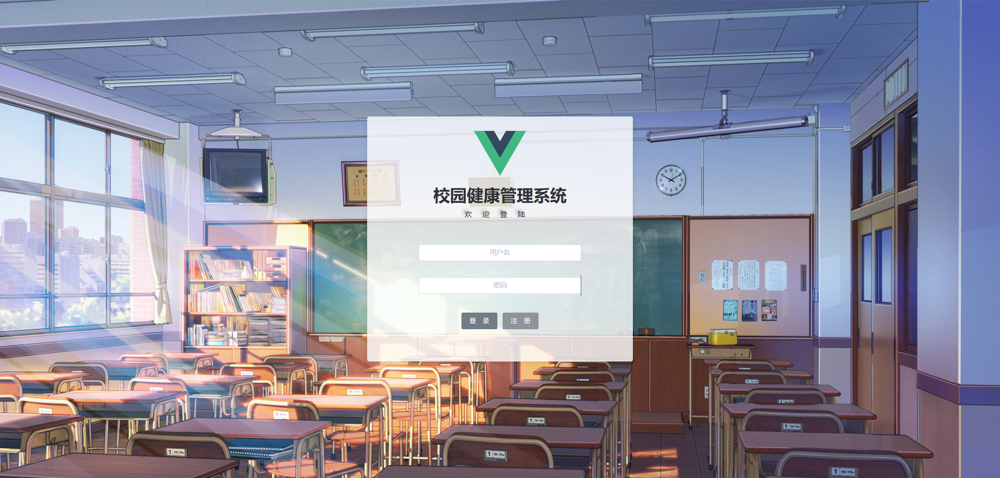

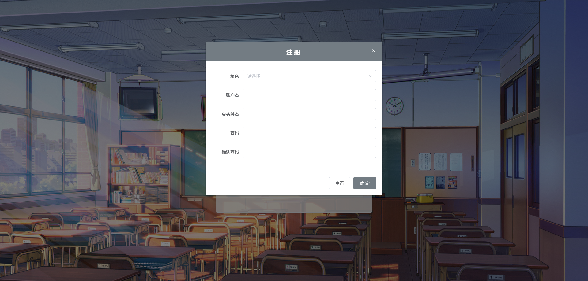

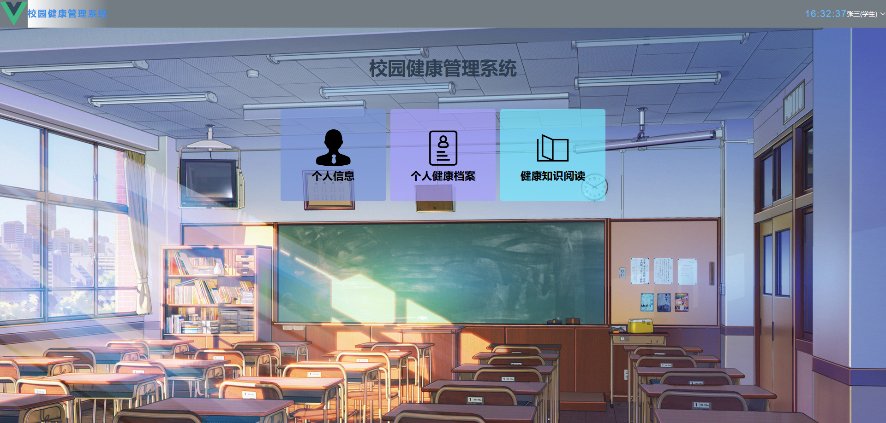

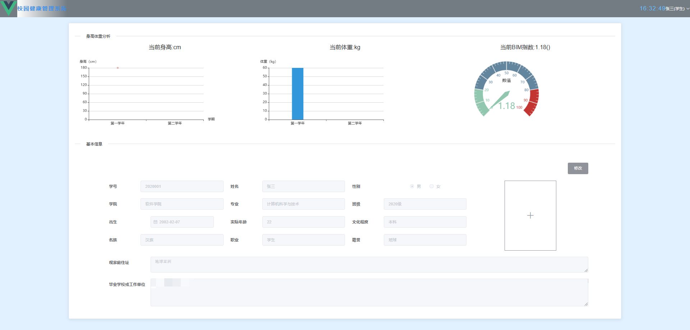

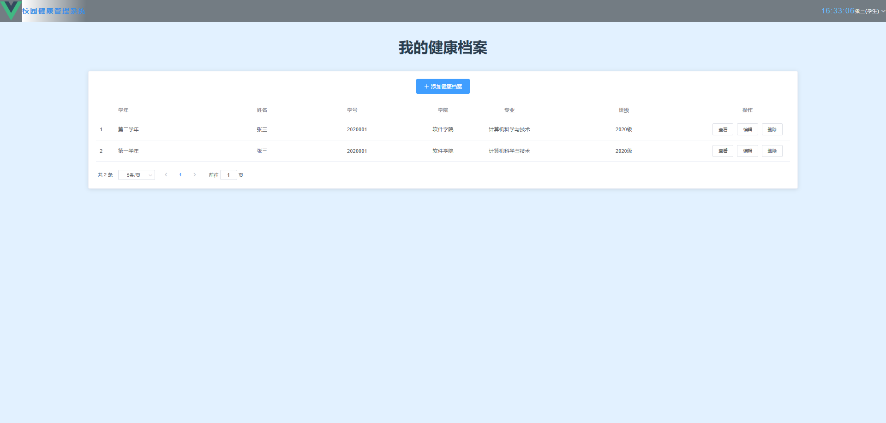

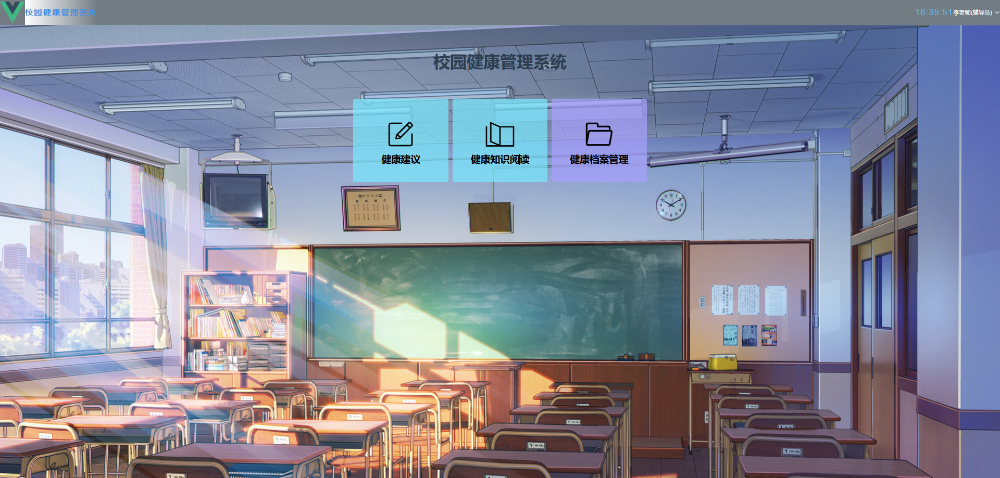

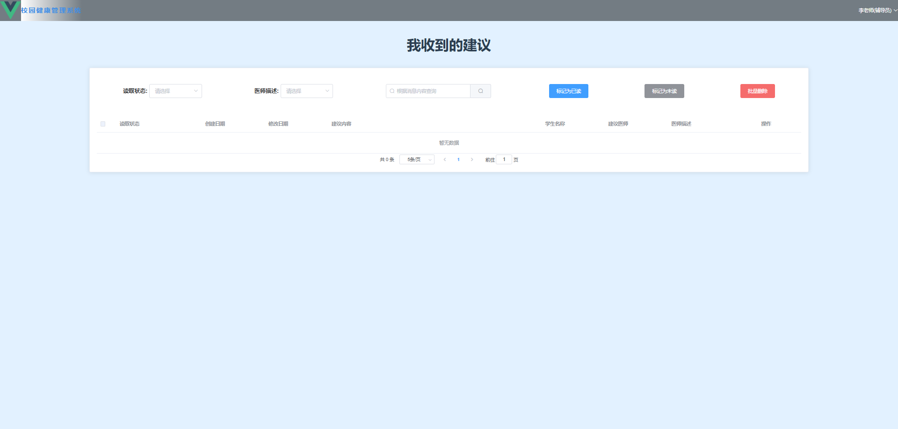

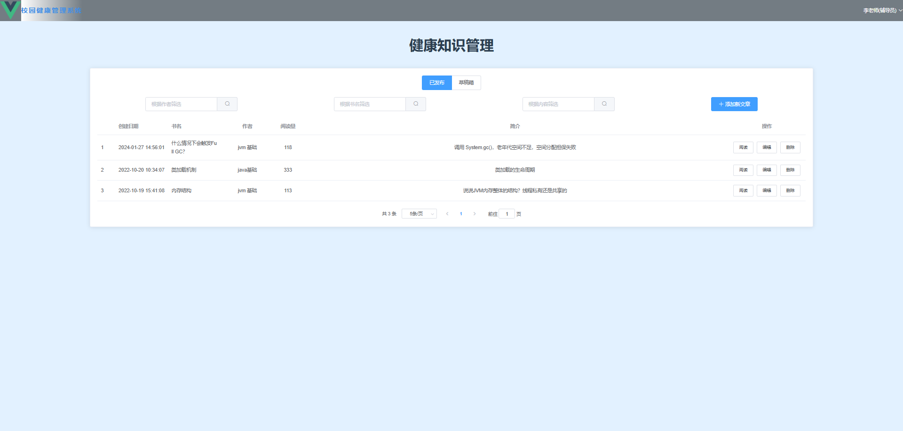

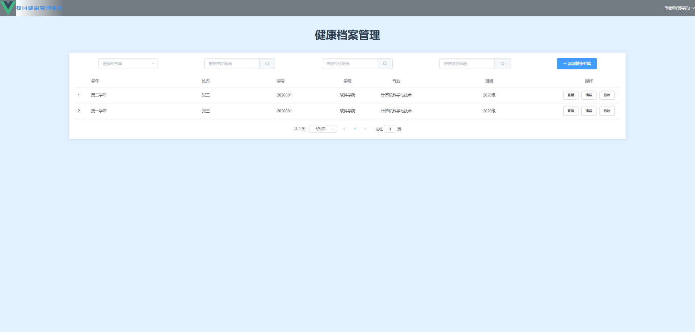

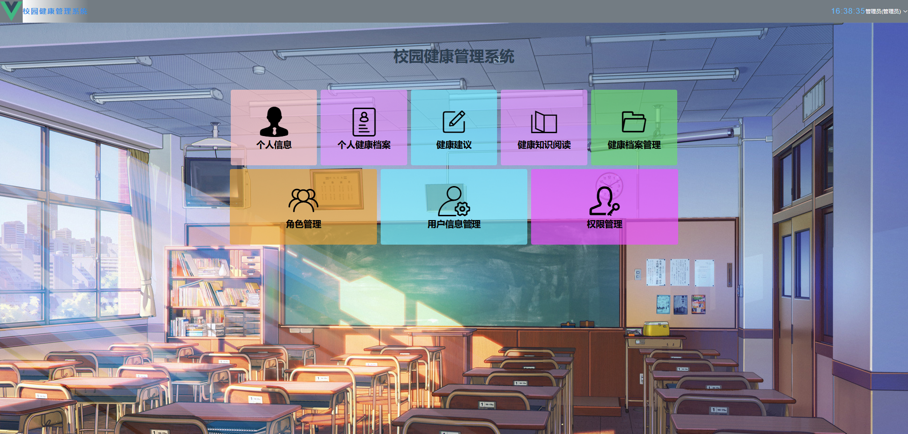

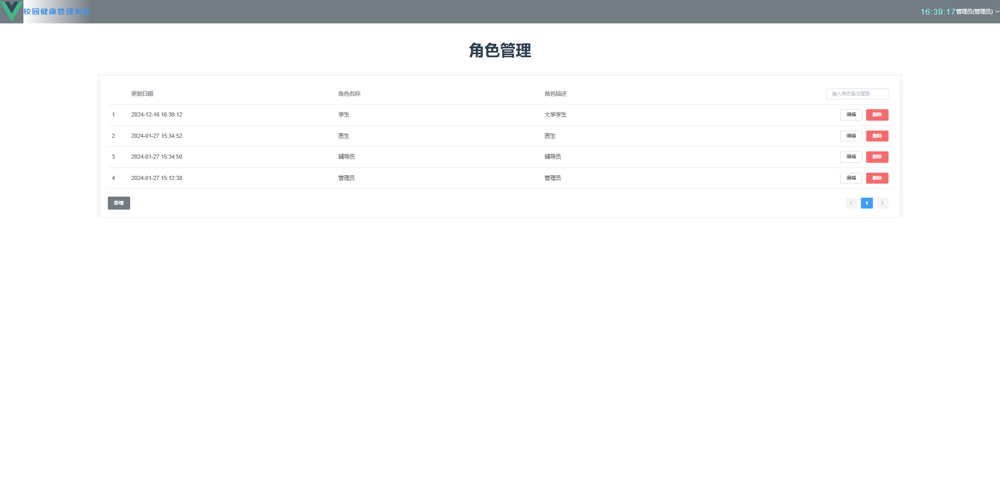

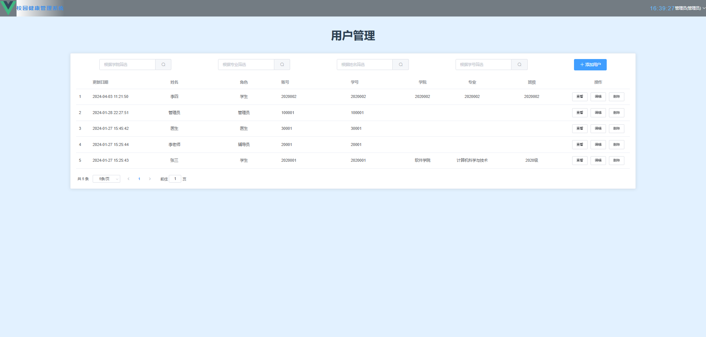

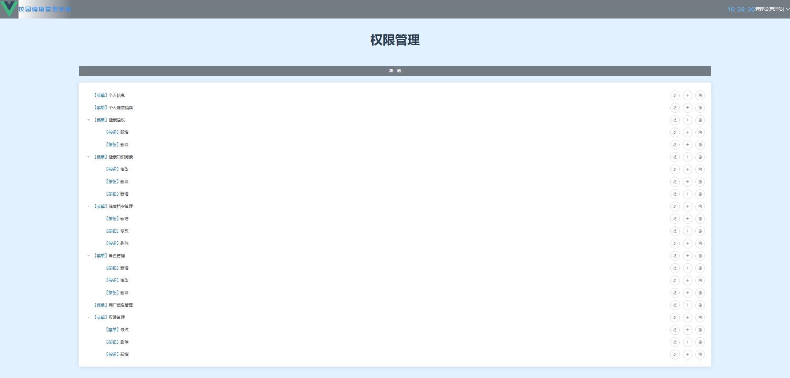

